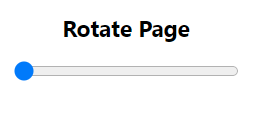

### How to Install it
```
Download extension (Click 'Clone or download' button and then 'Download zip')
Unzip
Navigate to "chrome://extensions" URL
Enable "Developer mode" checkbox at the top right corner
Click "Load unpacked extension..."
Browse and select extension folder (not the zip file)
```




